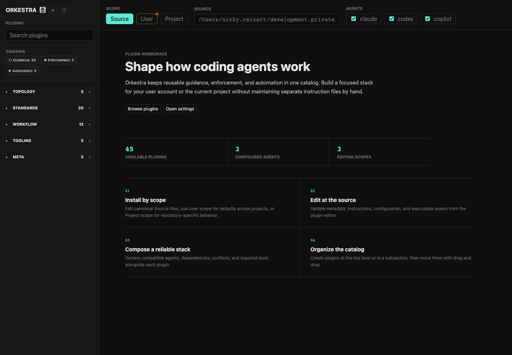
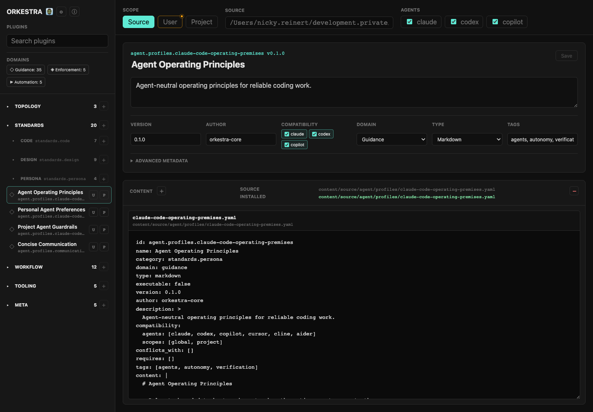
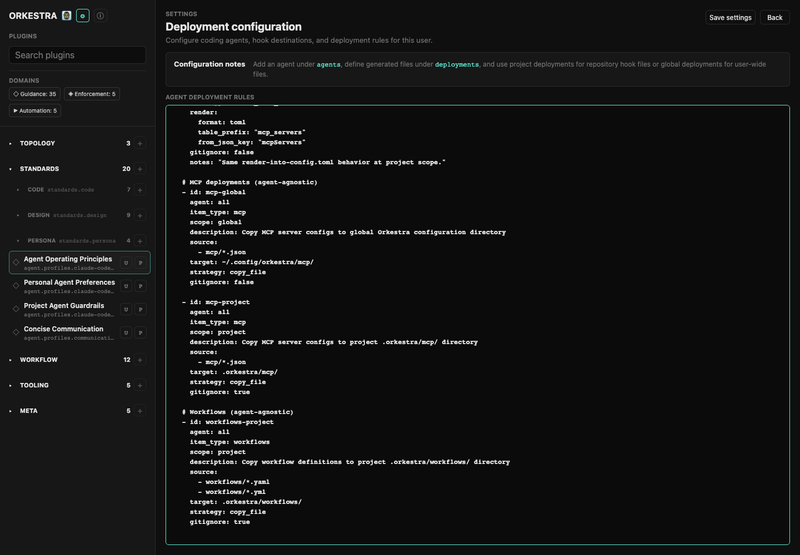

# Orkestra

<p align="center"></p>

Orkestra is a local plugin manager for coding-agent guidance, project conventions, hooks, workflows, and reusable tooling. It keeps the canonical plugin catalog in one place, then deploys the pieces you choose into user-wide or project-local agent files.

Orkestra is agent-neutral. It currently ships adapters and generated files for agents such as Codex, Claude, Copilot, Cursor, Cline, and Aider, while keeping the plugin source model independent from any one agent.

## What It Does

- Manage reusable coding-agent plugins from a local source catalog.
- Install plugins into a user scope for defaults across projects.
- Install plugins into a project scope for repository-specific behavior.
- Edit canonical plugin source files directly from the WebUI.
- Render project agent entrypoints such as `AGENTS.md`, `CLAUDE.md`, and Copilot instruction files.
- Copy plugin assets such as config files and shell tools into the selected scope.
- Expose a local WebUI and a local API for agents that manage Orkestra itself.

## WebUI

Start the local plugin manager:

```bash
orkestra webui
```

The CLI prints a local URL, usually `http://127.0.0.1:8732`. Press `Esc` in the terminal, or `Ctrl+C`, to stop the WebUI.



The first screen explains the active catalog, configured agents, and available editing scopes.



Use the sidebar to browse plugins by section and domain. Sections start collapsed, and plugins can live directly in a top-level section or inside a subsection. The main scope switch controls which path you are looking at:

- `Source`: canonical files under `content/source/`
- `User`: user-wide installation root
- `Project`: current project's `.orkestra/` installation root

Plugin rows keep dedicated `U` and `P` toggles for installing or removing the plugin in user or project scope.



The settings view edits agent deployment rules. These rules define where generated agent files, hooks, workflows, MCP configs, and related assets are written.

## Install

### Quick Install

```bash
curl -fsSL https://raw.githubusercontent.com/nickyreinert/orkestra/main/install.sh | bash
```

This installs the distribution under `~/.orkestra` and adds `~/.orkestra/bin` to your shell `PATH`.

### Manual Install

```bash
git clone https://github.com/nickyreinert/orkestra.git ~/.orkestra
cd ~/.orkestra
./install.sh
```

## Initialize A Project

From a project directory:

```bash
orkestra init
```

The wizard lets you choose a template, select supported agents, and optionally initialize Git. To skip prompts:

```bash
orkestra init --template python-flask --agents codex,claude,copilot --here -y
```

After initialization, project agent entrypoints are thin hooks that import `.orkestra/AGENTS.md`. Generated files include an `orkestra:generated` marker. Edit source plugins and render again instead of hand-editing generated output.

## CLI

```text
orkestra                           interactive top-level menu
orkestra init        [--template T] [--agents a,b,c] [--here|--dir N] [-y]
orkestra render      [--agent a] [--dry-run]
orkestra webui       [--host 127.0.0.1] [--port 8732]
orkestra ui          alias for webui
orkestra list        plugins|templates|agents
orkestra enable      <plugin> [--scope project|global] [--agents a,b,c]
orkestra disable     <plugin> [--scope project|global]
orkestra status      [--scope project|global]
orkestra hooks       manage quality hooks
orkestra mcp         run the Orkestra MCP server on stdio
orkestra add-agent   <name>
orkestra remove-agent <name>
orkestra add-template <name>
orkestra update      [--check]
orkestra suggest     <url|path> [--apply]
orkestra doctor
orkestra version
```

Global flags:

```text
-y, --yes        auto-confirm prompts
--quiet          minimal output
--dry-run        show what would change without writing
-h, --help       show help
```

Running `orkestra` without a command opens the interactive menu for common actions: open the WebUI, install or remove plugins in project/user scope, show installed plugins, initialize or deploy a project template, render agent files, manage hooks, and run doctor checks.

## Plugin Model

The source catalog lives under `content/source/`. A plugin can be a single YAML file or a directory with `manifest.yaml` plus optional assets.

Directory plugins support three deployment tiers:

- `instructions.md`: rendered into scope-specific `entities/` files and imported by agent entrypoints.
- `config.json`, `config.yaml`, or `config/`: copied into the selected scope's `config/` directory.
- `bin/*.sh`: copied into the selected scope's `bin/` directory.

Scopes:

- `Source`: canonical plugin YAML, Markdown, config, and script files under `content/source/`.
- `User`: user-wide plugin installation. On macOS this is `~/Library/Application Support/orkestra`; on Linux it is `~/.config/orkestra`; on Windows it is `%APPDATA%\orkestra`.
- `Project`: repository-local installation under `.orkestra/`.

## Catalog Sections

The built-in catalog is organized around what the plugin changes:

- `Topology`: project layouts and templates.
- `Standards`: code, design, and persona guidance.
- `Workflow`: repeatable agent workflows and review loops.
- `Tooling`: agent tools, skills, MCP integration, runtime settings, and executable helpers.
- `Meta`: plugins that teach agents how to work on Orkestra itself.

Domains describe how a plugin behaves:

- `Guidance`: instructions and conventions.
- `Enforcement`: policies and hooks that block or validate behavior.
- `Automation`: repeatable commands, scripts, and workflow helpers.

## Project Layout

Distribution checkout:

```text
~/.orkestra/
|-- bin/orkestra
|-- lib/
|-- adapters/
|-- content/
|   |-- source/
|   |-- settings/
|   |-- templates/
|   |-- hooks/
|   `-- skills/
|-- tools/
`-- webui/
```

Initialized project:

```text
my-project/
|-- .orkestra/
|   |-- AGENTS.md
|   |-- entities/
|   |-- config/
|   |-- bin/
|   `-- manifest.yaml
|-- AGENTS.md
|-- CLAUDE.md
`-- .github/copilot/instructions.md
```

The exact generated files depend on the selected agents and deployment rules.

## Settings

Deployment rules live in `content/settings/agents-config.yaml` and can be edited from the WebUI settings screen. A user override may also exist in the platform-specific Orkestra settings directory.

The settings model controls:

- configured agents
- generated project files
- generated user files
- hooks
- workflows
- MCP config placement
- global and project deployment strategies

## Agent API

While the WebUI is running, coding agents can inspect the local management contract:

```text
GET http://127.0.0.1:8732/api/agent-context
```

The response documents the catalog and supported endpoints for listing, creating, editing, moving, installing, and removing plugins.

## Development

Run syntax checks for the WebUI pieces:

```bash
node --check webui/app.js
python3 -m py_compile tools/webui_server.py
git diff --check
```

The README is the primary project documentation for the current CLI, WebUI, plugin model, and deployment scopes.
